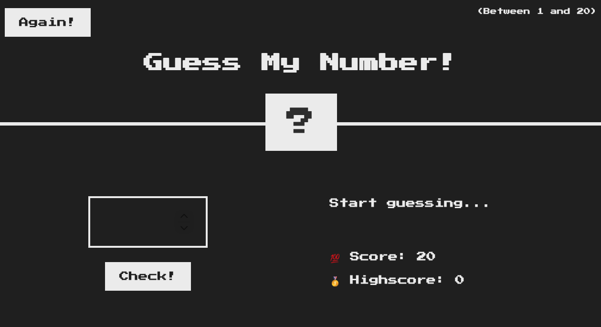

# Number Quest

A small browser game where the player guesses a secret number between 1 and 20.

## Preview

Open [index.html](index.html) in your browser to play.

## Files

- [index.html](index.html) — game UI and layout.
- [style.css](style.css) — styling for the game.
- [script.js](script.js) — game logic.

## How to play

1. Enter a number (1–20) in the input on the left.
2. Click "Check!" to submit your guess.
3. Messages tell you whether your guess is too high, too low, or correct.
4. Score decreases with each wrong guess. Click "Again!" to reset.

## Key functions / symbols

- [`getSecretNumber`](script.js) — generates the secret number.
- [`displayMessage`](script.js) — updates the UI message.
- [`checkEl`](script.js) — the "Check!" button element and its click handler.
- [`againEl`](script.js) — the "Again!" button element and its click handler.

You can find these in [script.js](script.js).

## Development

- Edit files and reload [index.html](index.html) in the browser.
- To serve locally (optional), run a simple static server in the project directory, for example:
  - Python: `python3 -m http.server`
  - Node: `npx serve .`

## Notes

- The game stores the current high score only for the session (no persistence).
- Styles use the "Press Start 2P" font; an internet connection is required to load it.
